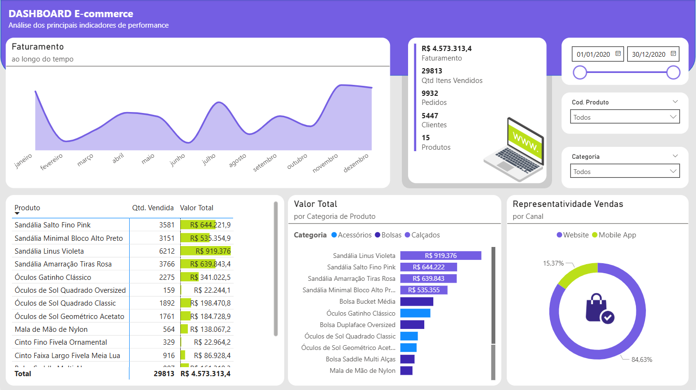

# 📊 Estudo de Caso: Dashboard de E-commerce

Este projeto apresenta a análise de desempenho de um e-commerce fictício, com foco em entender os principais indicadores de vendas, receita e comportamento do cliente ao longo do tempo.

---

## 🖼️ Prévia do Dashboard

  

*(Visualização principal do painel desenvolvido no Power BI)*

---

## 🎯 Desafio de Negócios

> **Objetivo:** Analisar o desempenho comercial e identificar padrões que influenciam a performance das vendas.
>
> * O e-commerce buscava compreender as **variações no volume de pedidos e receita mensal**, além de avaliar o impacto das promoções em diferentes categorias de produtos.  
> * A meta era **identificar gargalos e oportunidades de crescimento**, auxiliando na tomada de decisões estratégicas de marketing e estoque.

---

## 🛠️ Metodologia e Pipeline de Dados

**Ferramentas Utilizadas:** Power BI, Power Query, Excel (apoio).

1. **Tratamento e Limpeza de Dados:**  
   * Os dados foram importados e tratados via **Power Query**, com ajustes de formatação, criação de colunas calculadas e medidas em DAX.  
   * As tabelas de pedidos, produtos e clientes foram integradas em um modelo relacional otimizado.

2. **Análise e Visualização:**  
   * Criação de **gráficos dinâmicos e indicadores personalizados** no Power BI.  
   * Métricas principais: Receita Total, Ticket Médio, Vendas por Categoria, Vendas por Canal e Tendência Mensal.  
   * Design responsivo e intuitivo, destacando os **principais KPIs e variações de desempenho**.

---

## 💡 Resultados e Insights Estratégicos

O dashboard revelou:

* **Crescimento concentrado em categorias específicas**, indicando potencial para expansão de portfólio.  
* **Redução de receita em meses pós-campanhas**, sugerindo dependência de ações promocionais para manter o volume de vendas.  
* **Sugestão estratégica:** fortalecer programas de fidelização e diversificar canais de aquisição.

---

## 🔗 Acesso ao Projeto

[🌐 Ver Estudo de Caso Detalhado no Site Pessoal](https://sites.google.com/view/estevaoadm/página-inicial#h.4yw0kpduuu4z)
