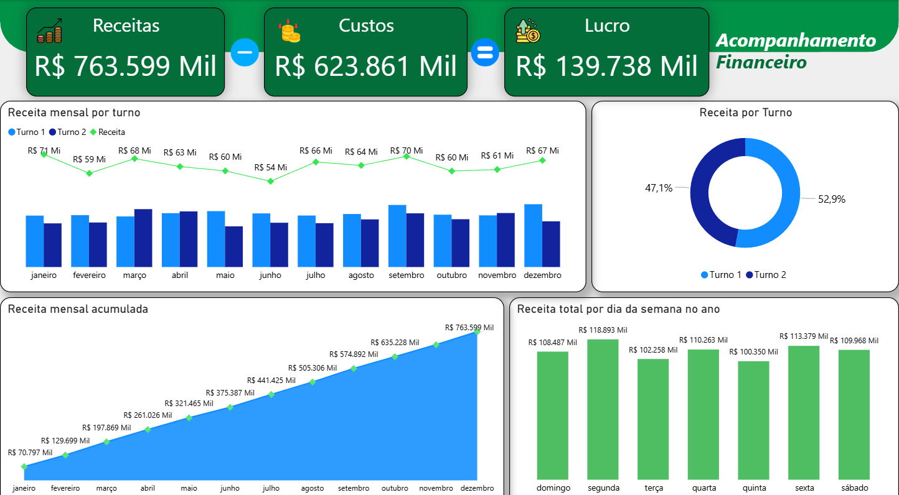

# 📊 Estudo de Caso: Dashboard Financeiro

Este projeto apresenta uma análise financeira fictícia com foco em entender o comportamento da receita, custos e lucro ao longo do ano, oferecendo uma visão clara sobre a saúde operacional e eficiência dos turnos.

---

## 🖼️ Prévia do Dashboard

  

---

## 🎯 Desafio de Negócios

> **Objetivo:** Avaliar o desempenho financeiro mensal e identificar pontos de atenção entre receita e custos.
>
> A empresa buscava visualizar de forma simples como os valores evoluíram ao longo do ano, além de entender quais turnos contribuíram mais para o faturamento e onde estavam os maiores gastos. A proposta do dashboard foi transformar esses números em insights práticos para apoiar decisões do dia a dia.

---

## 🛠️ Metodologia

**Ferramentas:** Power BI, Power Query, Excel.

* Os dados foram tratados no Power Query, com padronização de tipos e criação de colunas auxiliares (como número do mês para ordenação).
* No Power BI foram criadas medidas em DAX para cálculo de indicadores como **receita acumulada, custo acumulado e lucro**.
* O layout foi construído destacando KPIs principais e análises mensais, mantendo clareza e navegação intuitiva.

---

### 🧮 Medidas DAX Utilizadas

Receita Total = SUM('base_financeira'[receita])

Custo Total = SUM('base_financeira'[custo])

Lucro = [Receita Total] - [Custo Total]

Receita Acumulada =
CALCULATE(
    [Receita Total],
    FILTER(
        ALL('base_financeira'),
        'base_financeira'[data] <= MAX('base_financeira'[data])
    )
)

---

## 💡 Principais Insights

A análise financeira mostrou:

* A **receita se manteve estável**, mas alguns meses apresentaram custos mais elevados, reduzindo o lucro.
* O **turno da manhã** concentrou a maior parte da receita, indicando melhor desempenho operacional.
* O indicador de **lucro mensal** tornou mais clara a relação entre crescimento da receita e aumento de custos.

Esses padrões ajudam a direcionar ações de ajuste, controle e planejamento para os meses seguintes.

---

## 🔗 Acesso ao Projeto

[🌐 Ver Estudo de Caso Detalhado no Site Pessoal](https://sites.google.com/view/estevaoadm/p%C3%A1gina-inicial#h.l7yfso3c2n0u)
