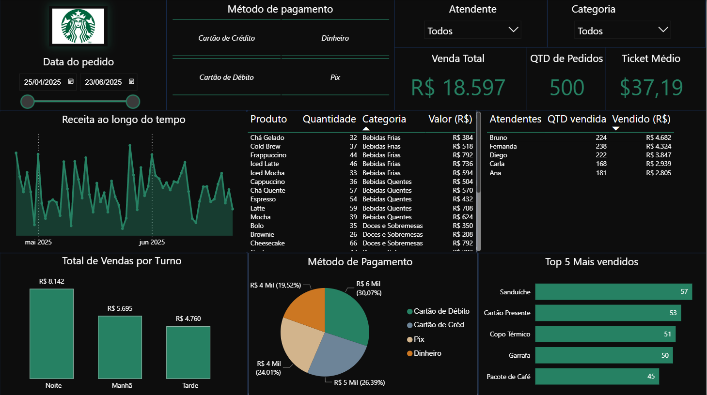

# ☕ Estudo de Caso: Dashboard de Vendas Starbucks

Este projeto simula a análise de dados de vendas de uma loja Starbucks, com foco em identificar padrões de consumo por turno, métodos de pagamento e performance de produtos.

---

## 🖼️ Prévia do Dashboard

  

*(Visualização principal do painel desenvolvido no Power BI)*

---

## 🎯 Desafio de Análise

> **Objetivo:** Oferecer uma visão gerencial rápida sobre os fatores que mais impactam a receita diária de uma unidade de varejo de alimentos e bebidas.
>
> * O desafio era consolidar dados transacionais para gerar **insights acionáveis** sobre a operação, como o turno de maior rentabilidade e a preferência de pagamento.

---

## 🛠️ Metodologia e Pipeline de Dados

**Tecnologias Utilizadas:** Power BI, Excel/CSV, Power Query.

1. **ETL e Transformação de Dados:**
   * O tratamento de dados foi realizado via **Power Query**, focando na limpeza e padronização das colunas de tempo para criar a dimensão de `Turno` (Manhã, Tarde, Noite).

2. **Modelagem e DAX:**
   * O modelo foi desenhado para calcular a **Receita por Turno** e a **Distribuição Percentual de Pagamentos**.

---

## 💡 Resultados e Insights Operacionais

O dashboard revelou os seguintes insights (baseado nos dados fictícios):

* **Turno de Maior Valor:** A **Manhã** é o período mais rentável, com a maior concentração de receita.
* **Comportamento de Pagamento:** O **Cartão de Crédito** é o método de pagamento preferencial.

---

## 🔗 Acesso ao Projeto

🌐 [Ver Estudo de Caso Detalhado no Site Pessoal](https://sites.google.com/view/estevaoadm/p%C3%A1gina-inicial)
